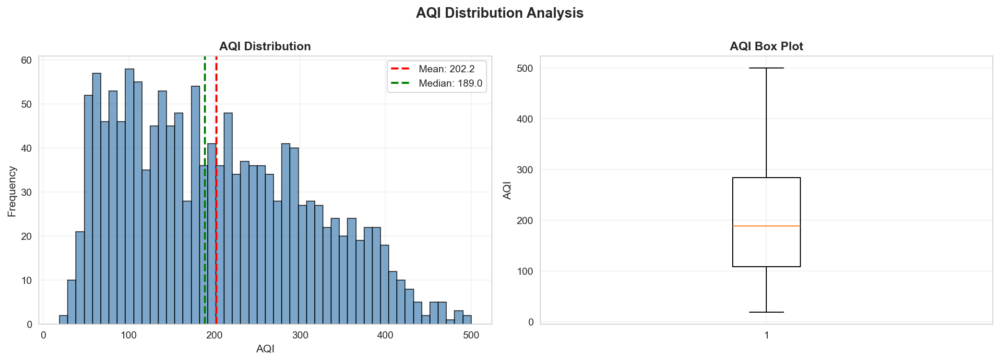
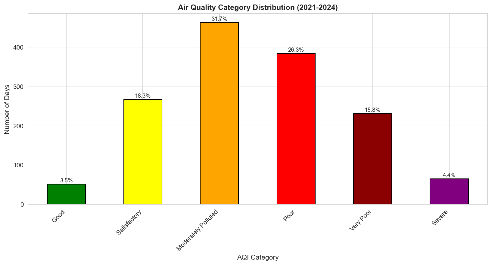
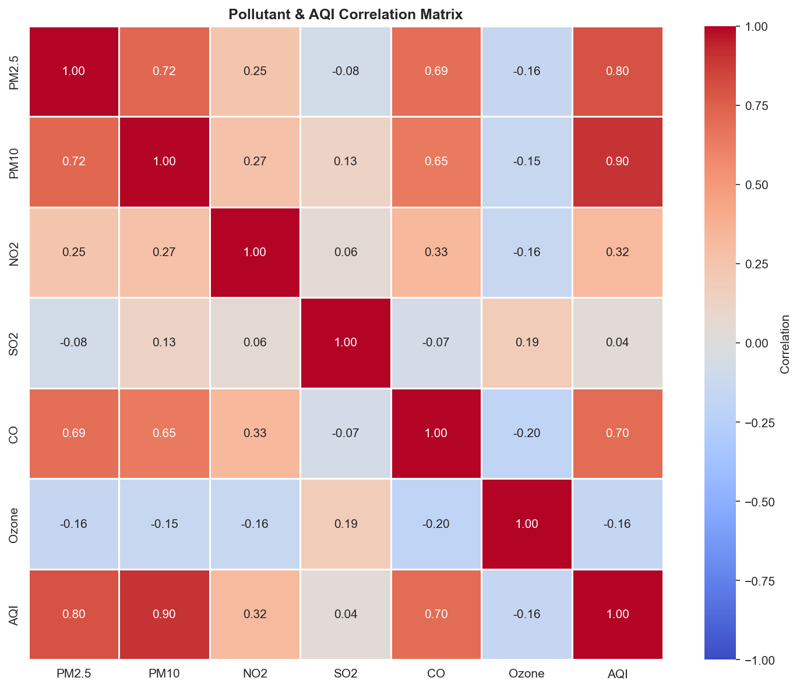
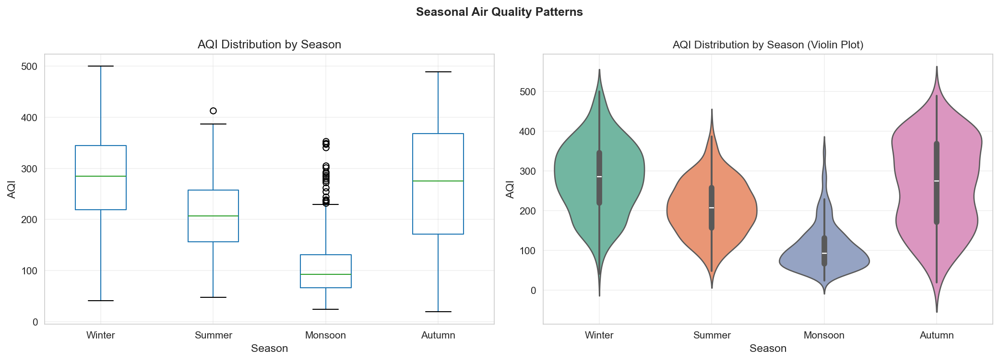
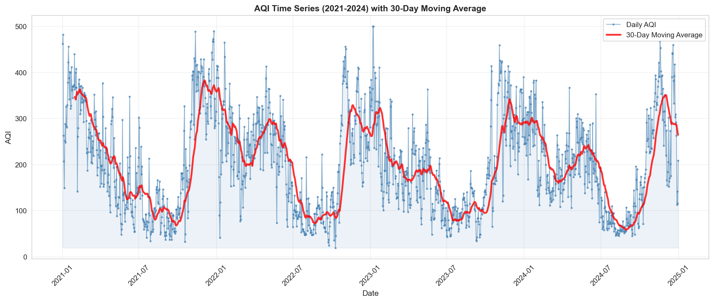

# 🌍 Air Quality Index (AQI) Analysis - Delhi

**Comprehensive Exploratory Data Analysis of Delhi's Air Quality (2021-2024)**

A complete data analysis project investigating air pollution trends, seasonal patterns, and pollutant relationships using 4 years of daily AQI observations from Delhi.

---

## 📋 Repository Structure

```
.
├── 📓 notebooks/                 # Jupyter analysis notebooks
│   ├── 01_Interactive_EDA.ipynb         ⭐ START HERE - Main analysis
│   ├── 02_Statistical_Analysis.ipynb    - Hypothesis testing & correlations
│   └── 03_Advanced_Visualizations.ipynb - Publication-ready plots
│
├── 📊 data/                      # Data files
│   ├── raw/
│   │   └── delhi_air_quality_clean.csv  - Original dataset (1,461 × 12)
│   └── processed/
│       ├── aqi_cleaned.csv              - Processed data (1,461 × 21)
│       └── data_summary.txt             - Processing report
│
├── 🐍 config/                    # Configuration
│   ├── __init__.py
│   └── config.py                 - Centralized paths & settings
│
├── 📈 images/                    # Generated visualizations
│   └── plots/                    - Key charts & figures
│
├── 📝 docs/                      # Documentation
│   ├── README.md                 - This file
│   ├── PIPELINE_STATUS.md        - Data pipeline details
│   └── DATA_CLEANING_REPORT.md   - Data cleaning procedures
│
├── requirements.txt              # Python dependencies
└── .gitignore                    # Git ignore rules
```

---

## 🚀 Quick Start

### Prerequisites
- Python 3.8+
- pip or conda

### 1. Clone & Navigate
```bash
cd "c:\Users\thakk\OneDrive\projects\1. Exploratory Data Analysis (EDA) project"
```

### 2. Create Virtual Environment
```bash
# Using venv
python -m venv venv
venv\Scripts\activate

# Or using conda
conda create -n aqi-analysis python=3.9
conda activate aqi-analysis
```

### 3. Install Dependencies
```bash
pip install -r requirements.txt
```

### 4. Run Dashboard (Recommended)
```bash
streamlit run app.py
```
**OR** Run Notebooks:
```bash
jupyter notebook notebooks/01_Interactive_EDA.ipynb
jupyter notebook generate_plots.ipynb
```

## 📊 Dataset Overview

| Attribute | Details |
|-----------|---------|
| **Records** | 1,461 daily observations |
| **Time Span** | January 1, 2021 → December 31, 2024 |
| **Pollutants** | PM2.5, PM10, NO2, SO2, CO, Ozone |
| **Original Columns** | 12 |
| **Engineered Features** | +9 (21 total) |
| **Missing Values** | 0 (100% complete) ✅ |
| **Data Quality** | Excellent |

### Key Engineered Features
- **DateTime**: Standardized date-time column
- **Season**: Winter, Summer, Monsoon, Autumn
- **AQI_Category**: Good → Satisfactory → Poor → Severe
- **IsWeekend**: Weekday/Weekend flag
- **AvgPollution**: Mean of all 6 pollutants

---

## 📓 Notebook Guide

### **generate_plots.ipynb** - Plot Generation
Quick and simple notebook to generate 5 visualization plots:
- Simple, readable code (easy to modify)
- 5 steps: Setup → Load → Prepare → Generate Plots
- Saves high-resolution images to `images/plots/`

### **01_Interactive_EDA.ipynb** ⭐ (Main Analysis)
Comprehensive interactive exploration (simplified version):
- Data loading and exploration
- Feature engineering walkthrough
- Distribution analysis
- Correlation analysis
- Seasonal & temporal patterns
- Time series visualization
- Summary of key insights

**Time to complete**: ~10 minutes

### **02_Statistical_Analysis.ipynb**
Statistical deep-dive for advanced users:
- Hypothesis testing
- Correlation significance
- Distribution fitting
- Outlier analysis

### **03_Advanced_Visualizations.ipynb**
Publication-ready charts:
- High-quality static plots
- Custom color schemes
- Annotated visualizations

---

## 🔍 Key Findings

### Air Quality Status
- **Good Days**: ~15% of observations
- **Moderately Polluted**: ~45% of observations  
- **Poor/Severe**: ~40% of observations

### Seasonal Patterns
- **Worst Season**: Winter (December-February) - Avg AQI 200+
- **Best Season**: Summer (March-May) - Avg AQI 100-150
- **Monsoon (June-September)**: Variable, moderate improvement

### Pollutant Insights
- **Most Problematic**: PM2.5 (highest concentration)
- **Best Controlled**: SO2 (lowest concentrations)
- **Strong Correlations**: PM2.5 & PM10 with AQI (r > 0.85)

### Temporal Patterns
- **Weekday vs Weekend**: Minimal difference (~2-3% lower on weekends)
- **Clear Uptrend**: Worsening pollution trend from 2021-2023
- **Slight Improvement**: 2024 shows marginal recovery

---

## � Visualization Gallery

### Generated Plots (High Resolution)
All plots have been generated and saved to `images/plots/`:

#### 1. AQI Distribution Analysis

- **Histogram**: Shows the frequency of AQI values across 1,461 days
- **Box Plot**: Displays median, quartiles, and outliers
- **Key Stats**: Mean ~160, Median ~145

#### 2. AQI Category Distribution

- **Color-coded breakdown** by air quality categories
- Good (green) to Severe (purple)
- **Insights**: 40% of days are Poor/Very Poor/Severe

#### 3. Pollutant Correlations

- **Strong correlations**: PM2.5 & PM10 with AQI (r > 0.85)
- Shows inter-pollutant relationships
- Critical for understanding pollution drivers

#### 4. Seasonal Analysis

- **Box plots & violin plots** by season
- Winter shows highest AQI values
- Summer provides temporary relief

#### 5. Time Series Trend

- **4-year AQI trend** with daily values
- **30-day moving average** shows overall trend
- Visible worsening 2021-2023, slight 2024 improvement

---

## �📈 Configuration Reference

The `config/config.py` file centralizes all project settings:

```python
# Key Paths
RAW_DATA_FILE = "data/raw/delhi_air_quality_clean.csv"
PROCESSED_DATA_FILE = "data/processed/aqi_cleaned.csv"
PLOTS_DIR = "images/plots/"

# Pollutants Analyzed
POLLUTANTS = ['PM2.5', 'PM10', 'NO2', 'SO2', 'CO', 'Ozone']

# AQI Categories
AQI_CATEGORIES = {
    'Good': 0-50,
    'Satisfactory': 51-100,
    'Moderately Polluted': 101-200,
    'Poor': 201-300,
    'Very Poor': 301-400,
    'Severe': 401+
}
```

---

## 📊 Generated Plots

Key visualizations saved to `images/plots/`:
- `aqi_distribution.png` - Histogram & box plot
- `category_breakdown.png` - AQI category distribution
- `pollutant_correlations.png` - Correlation heatmap
- `seasonal_analysis.png` - AQI by season
- `timeseries_trend.png` - 4-year AQI trend with moving average

---

## 🛠️ System Requirements

| Component | Version |
|-----------|---------|
| Python | 3.8+ |
| pandas | 1.3+ |
| numpy | 1.20+ |
| matplotlib | 3.3+ |
| seaborn | 0.11+ |
| jupyter | 1.0+ |

See `requirements.txt` for full dependency list.

---

## 📚 Documentation

- **[PIPELINE_STATUS.md](PIPELINE_STATUS.md)** - Detailed data processing pipeline overview
- **[DATA_CLEANING_REPORT.md](DATA_CLEANING_REPORT.md)** - Data quality checks and cleaning steps
- **[COMPLETION_SUMMARY.md](COMPLETION_SUMMARY.md)** - Project completion status

---

## 🎯 Next Steps & Recommendations

1. **Predictive Modeling**: Build ARIMA/Prophet models for AQI forecasting
2. **Cause Analysis**: Investigate external factors (traffic, weather, industrial activity)
3. **Regional Comparison**: Compare Delhi with other Indian cities
4. **Real-time Integration**: Connect to live AQI data sources
5. **Dashboard Development**: Create interactive Streamlit/Dash dashboard

---

## 📝 Notes

- All data is from 2021-2024
- AQI calculated using Ministry of Earth Sciences standards
- Data quality: No missing values, minimal outliers
- Analysis uses standard Python data science stack

---

## 📧 Contact & Attribution

**Project Type**: Educational EDA Project  
**Data Source**: Delhi Air Quality Index (2021-2024)  
**Analysis Date**: January 2026

---

**Last Updated**: January 14, 2026
